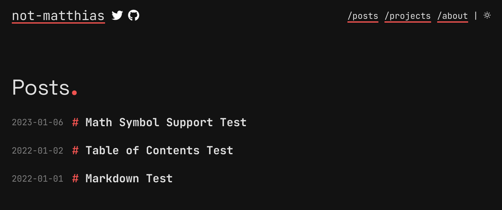
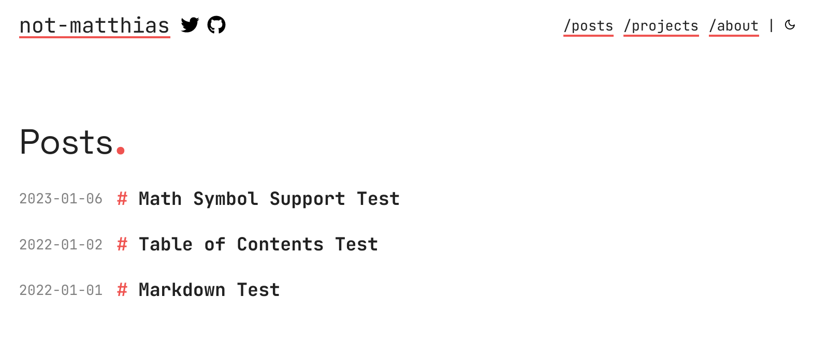

# myBlog

Modern and minimalistic blog powered by [Zola](https://getzola.org) and a modified version of its theme [apollo](https://not-matthias.github.io/apollo).

Named after the greek god of knowledge, wisdom and intellect

  
Dark theme

  

  
Light theme

## Features

- [X] Pagination
- [X] Themes (light, dark, auto)
- [X] Projects page
- [X] Analytics using [GoatCounter](https://www.goatcounter.com/) / [Umami](https://umami.is/)
- [x] Social Links
- [x] MathJax Rendering
- [x] Taxonomies
- [x] Meta Tags For Individual Pages
- [ ] Search
- [ ] Categories